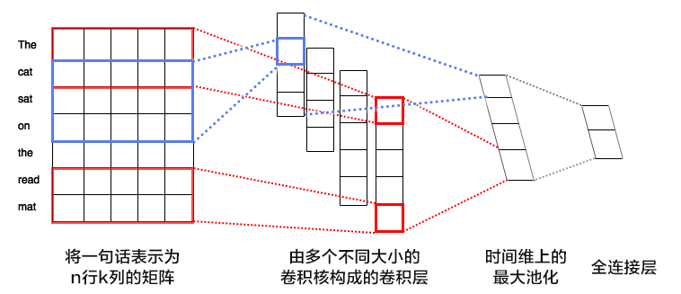
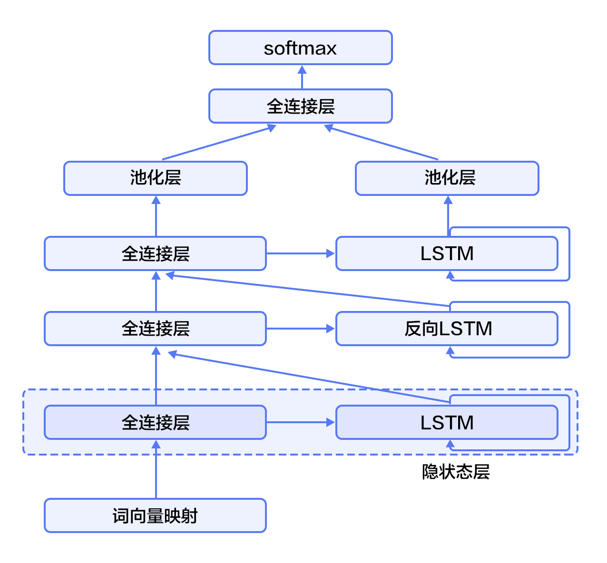

# 情感分析
## 背景介绍
&emsp;&emsp;在自然语言处理中，情感分析一般是指判断一段文本所表达的情绪状态。其中，一段文本可以是一个句子，一个段落或一个文档。情绪状态可以是两类，如（正面，负面），（高兴，悲伤），也可以是三类，如（积极，消极，中性）等等。
&emsp;&emsp;情感分析的应用场景十分广泛，如把用户在购物网站（亚马逊、天猫、淘宝等）、旅游网站、电影评论网站上发表的评论分成正面评论和负面评论。为了分析用户对于某一产品的整体使用感受，抓取产品的用户评论并进行情感分析等等。
&emsp;&emsp;对电影评论进行情感分析（正面，负面）的例子如下面的表格1所示。

| 电影评论       | 类别  |
| --------     | -----  |
| 在冯小刚这几年的电影里，算最好的一部的了| 正面 |
| 很不好看，好像一个地方台的电视剧     | 负面 |
| 为了讽刺官场刻意丑化农村人的傻片子，圆方镜头全程炫技，色调背景美则美矣，但剧情拖沓，口音不伦不类，一直努力却始终无法入戏。不建议进电影院观看，不然睡着了躺都没地方躺。| 负面|
|剧情四星。但是圆镜视角加上婺源的风景整个非常有中国写意山水画的感觉，看得实在太舒服了。。难怪作为今年TIFF special presentation的开幕电影。范爷美爆，再往上加一星。|正面|

表格 1 电影评论情感分析

&emsp;&emsp;实际上，在自然语言处理中，情感分析属于典型的**文本分类**问题，即，把需要进行情感分析的文本划分为其所属类别。文本分类问题可以分解为两个子问题：文本表示和分类。在深度学习的方法出现之前，主流的文本表示方法为BOW(bag of words)，分类方法有SVM,LR,Boosting等等。BOW忽略了词的顺序信息，而且是高维度的稀疏向量表示，这种表示浮于表面，并未充分表示文本的语义信息。例如，句子`这部电影糟糕透了`和`一个乏味，空洞，没有内涵的作品`在情感分析中具有很高的语义相似度，但是它们的BOW表示的相似度为0。又如，句子`小明很喜欢小芳，但是小芳不喜欢小明`和`小芳很喜欢小明，但是小明不喜欢小芳`的BOW相似度为1，但实际上它们的意思很不一样。本章我们所要介绍的深度学习模型克服了BOW表示的上述缺陷，它在考虑词的顺序的基础上把文本映射到低维度的语义空间，并且以端对端（end to end）的方式进行文本表示及分类，其性能相对于传统方法有显著的提升。
## 模型概览
&emsp;&emsp;本章所使用的文本表示模型为卷积神经网络（Convolutional Neural Networks）和循环神经网络(Recurrent Neural Networks)及其扩展。我们首先介绍处理文本的卷积神经网络。
### 文本卷积神经网络
&emsp;&emsp;卷积神经网络经常用来处理具有类似网格拓扑结构（grid-like topology）的数据。例如，图像可以视为2D网格的像素点，自然语言可以视为1D的词序列。卷积神经网络可以提取多种局部特征，并对其进行组合抽象得到更高级的特征表示，且其对于数据的某些变化具有不变性。大量实验表明，卷积神经网络能高效的对图像及文本问题进行建模处理。本小结我们讲解如何使用卷积神经网络处理文本（以句子为例）。

图 1 卷积神经网络文本分类模型

&emsp;&emsp;假设一个句子的长度为$n$，其中第$i$个词的word embedding为$x_i\in\mathbb{R}^k$,其维度大小为$k$，我们可以将整个句子表示为$x_{1:n}=x_1\oplus x_2\oplus \ldots \oplus x_n$，其中，$\oplus$表示拼接（concatenation）操作。一般地，我们用$x_{i:i+j}$表示词序列$x_{i},x_{i+1},\ldots,x_{i+j}$的拼接。卷积操作把filter(也称为kernel)$w\in\mathbb{R}^{hk}$应用于包含$h$个词的窗口$x_{i:i+h-1}$，得到特征$c_i$：
$$c_i=f(w\cdot x_{i:i+h-1}+b)$$
&emsp;&emsp;其中$b\in\mathbb{R}$为偏置项(bias)，$f$为非线性激活函数，如sigmoid。将filter应用于句子中所有的词窗口${x_{1:h},x_{2:h+1},\ldots,x_{n-h+1:n}}$序列，产生一个feature map：
$$c=[c_1,c_2,\ldots,c_{n-h+1}]$$
&emsp;&emsp;其中$c \in \mathbb{R}^{n-h+1}$。接下来我们对feature map采用max pooling over time操作得到此filter对应的特征：
$$\hat c=max(c)$$
&emsp;&emsp;即，$\hat c$是feature map中所有元素的最大值。pooling机制自动处理了句子长度不一的问题。在实际应用中，我们会使用多个filter来处理句子，窗口大小相同的filters堆叠起来形成一个矩阵（上文中的单个filter参数$w$相当于矩阵的某一行），这样可以更高效的完成运算。另外，我们也可使用窗口大小不同的filters来处理句子，最后，将所有filters得到的特征拼接起来即为文本的定长向量表示。对于文本分类问题，将其连接至softmax即构建出完整的模型。
&emsp;&emsp;可以将上文所述的卷积神经网络的filter理解为特定语义n-gram的探测器（detector），其优点是避免了传统n-gram的高维稀疏表示问题，运算和训练速度十分快，准确率也很高（ref）。但是它难以扩展为深层文本卷积网络，基于此，N. Kalchbrenner, et al.(2014)提出了k-max pooling，使用其可以构建出深层文本卷积网络，有兴趣的读者可以参考相关文献。
### 循环神经网络
#### 简单的循环神经网络
&emsp;&emsp;循环神经网络是一种能对序列数据进行精确建模的有力工具。实际上，循环神经网络的理论计算能力是图灵完备的(Siegelmann, H. T. and Sontag, E. D., 1995)。
&emsp;&emsp;自然语言是一种典型的序列数据（词序列），近年来，循环神经网络及其变体(如lstm等)在自然语言处理的多个领域取得了丰硕的成果，如在语言模型，句法解析，语义角色标注（或一般的序列标注），语义表示，图文生成，对话，机器翻译等任务上均表现优异甚至成为目前效果最好的方法。

图 1 循环神经网络按时间展开的示意图

&emsp;&emsp;循环神经网络按时间展开后如图1所示:在第$t$时刻，网络读入第$t$个输入$x_t$（向量表示）及前一时刻隐藏层的输出$h_{t-1}$（向量表示，$h_0$一般初始化为$0$向量），计算得出本时刻隐藏层的值$h_t$，重复这一步骤直至读完所有输入。如果将循环神经网络所表示的函数记为$f$，则其公式可表示为：
$$h_t=f(x_t,h_{t-1})=\sigma(W_{xh}x_t+W_{hh}h_{h-1}+b_h)$$
&emsp;&emsp;其中$W_{xh}$是输入到隐层的矩阵参数，$W_{hh}$是隐层到隐层的矩阵参数，$b_h$为隐层的偏置向量（bias）参数，$\sigma$为elementwise的sigmoid函数。在处理自然语言时，一般会先将词（one-hot表示）映射为其embedding表示，然后再作为循环神经网络每一时刻的输入$x_t$。可以根据实际需要的不同在循环神经网络的隐层上连接其它层。如，可以把一个循环神经网络的隐层输出连接至下一个循环神经网络的输入构建深层（deep or stacked）循环神经网络，或者提取最后一个时刻的隐层状态作为句子表示进而使用分类模型等等。
&emsp;&emsp;可以看出，隐状态的输入来源于当前输入和前一时刻隐状态的值，这会导致很久以前的输入容易被覆盖掉。实际上，人们发现当序列很长时，循环神经网络就会表现很差（远距离依赖问题），训练过程中会出现梯度消失或爆炸现象(Bengio Y, Simard P, Frasconi P., 1994)。为了解决这一问题，Hochreiter S, Schmidhuber J. (1997)提出了lstm模型。
#### 长时短期记忆循环神经网络
&emsp;&emsp;相比于简单的循环神经网络，lstm增加了记忆单元$c$，输入门$i$，遗忘门$f$及输出门$o$，这些门及记忆单元组合起来大大提升了循环神经网络处理远距离依赖问题的能力，若将基于lstm（无 peep-hole连接的版本）的循环神经网络表示的函数记为F，则其公式为：
$$ h_t=F(x_t,h_{t-1})$$
&emsp;&emsp;$F$由下列公式组合而成：
\begin{align}
i_t & = \sigma(W_{xi}x_t+W_{hi}h_{h-1}+b_i)\\\\
f_t & = \sigma(W_{xf}x_t+W_{hf}h_{h-1}+b_f)\\\\
c_t & = f_t\odot c_{t-1}+i_t\odot tanh(W_{xc}x_t+W_{hc}h_{h-1}+b_c)\\\\
o_t & = \sigma(W_{xo}x_t+W_{ho}h_{h-1}+b_o)\\\\
h_t & = o_t\odot tanh(c_t)\\\\
\end{align}
&emsp;&emsp;其中，$i_t, f_t, c_t, o_t$分别表示输入门，遗忘门，记忆单元（记忆单元一般对外不可见,$h_t$对外部可见）及输出门的向量值，带角标的$W$及$b$为模型参数，$tanh$为elementwise的双曲正切函数，$\odot$表示elementwise的乘法操作。输入门控制着新输入进入记忆单元$c$的强度，遗忘门控制着记忆单元维持上一时刻值的强度，输出门控制着输出记忆单元的强度。三种门的计算方式类似，但有着完全不同的参数。这三种门各自以不同的方式控制着记忆单元$c$。实际上，lstm的思想正是通过给简单的循环神经网络增加记忆及控制门的方式增强了其处理远距离依赖问题的能力。类似原理的对于简单循环神经网络的改进还有Gated Recurrent Unit (GRU)( Cho K, Van Merriënboer B, Gulcehre C, et al. 2014),其设计更为简洁一些。**这些改进虽然各有不同，但是对他们的宏观描述却与简单的循环神经网络一样，如图1所示，隐状态依据当前输入及前一时刻的隐状态来改变，不断的循环这一过程直至输入处理完毕：**
$$ h_t=Recrurent(x_t,h_{t-1})$$
&emsp;&emsp;对于正常顺序的循环神经网络而言，$h_t$包含了$t$时刻之前的输入信息，也就是上文信息。同样，为了得到下文信息，我们可以使用反方向（将输入逆序处理）的循环神经网络。结合构建深层循环神经网络的方法，我们可以构建更加强有力的深层双向循环神经网络（deep bi-directional recurrent neural networks）对时序数据进行建模。
#### 使用循环神经网络的组合进行文本分类
&emsp;&emsp;一个简单的做法是分别使用正向lstm-rnn和反向lstm-rnn处理文本，取最后一个时刻的隐层值拼接起来做为文本的定长向量表示，将其连接至softmax得到文本分类模型。但是这样的文本分类模型是一个浅层模型。考虑到深层神经网络往往能得到更抽象和高级的特征表示，我们构建stacked lstm-rnn。如图2所示（以三层为例），奇数层lstm正向，偶数层lstm反向，高一层的lstm使用低一层lstm及之前所有层的信息作为输入，对最高层lstm序列使用max pooling over time得到文本定长向量表示。**这一表示充分融合了文本的上下文信息，并且对文本进行了深层次抽象。**最后我们将文本表示连接至softmax构建分类模型。

图 2 stacked lstm-rnn for text classification

## 参考文献